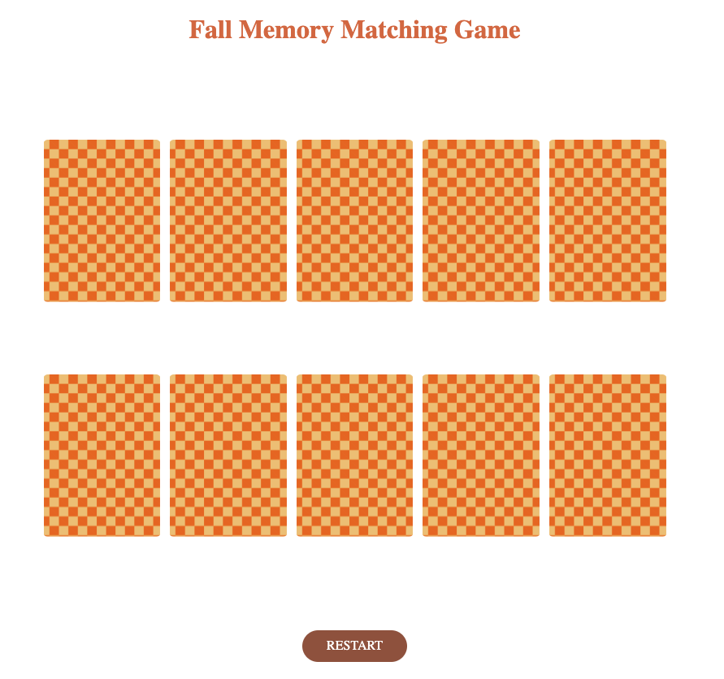
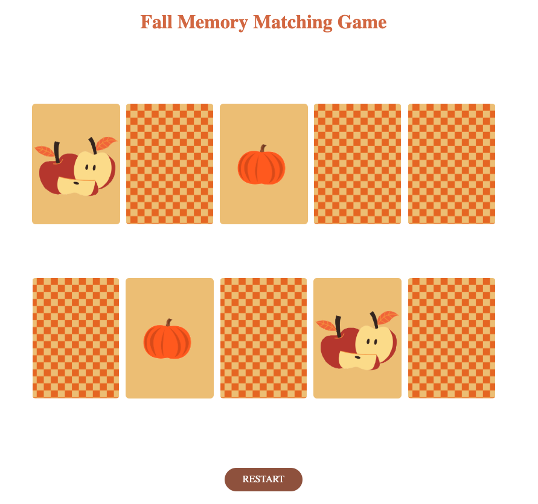

# Fall Themed Memory Matching Game

This is a 10-card memory game where users test their memory by finding matching pairs. Players select two cards at a time to check for a match, with the game concluding once all pairs are correctly matched.

**Project Link:** 

## Features

- **Card Matching Gameplay:** Users can select two cards to check for a match.
- **Interactive Feedback:** Matched cards stay flipped, while unmatched cards flip back over.
- **Game Completion:** The game ends when all cards are successfully matched and flipped.
- **Engaging Design:** Provides an interactive and visually appealing experience to challenge memory skills.

## Tech Used:

- HTML
- CSS
- JavaScript

### Screenshots

 
 
